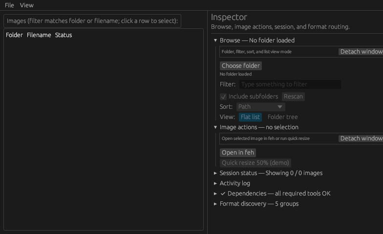
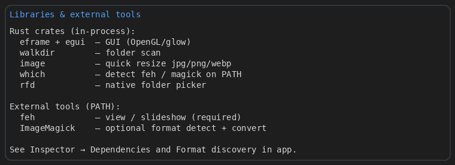
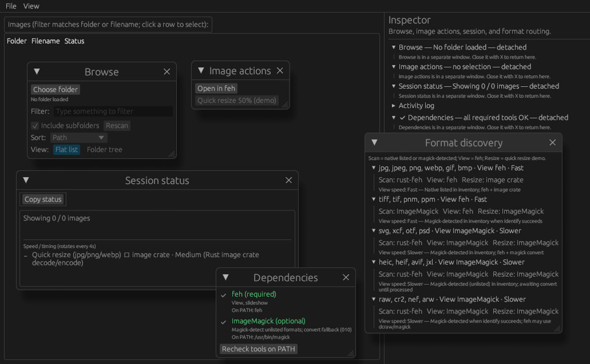
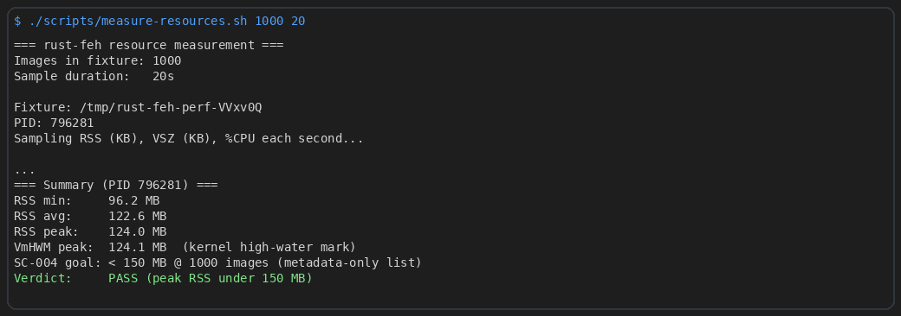
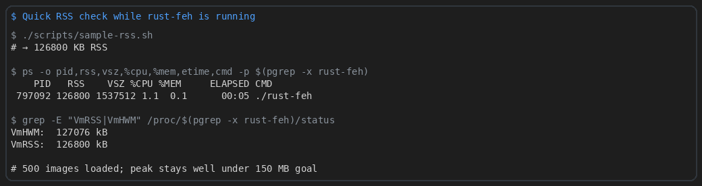

# rust-feh



Linux-first **feh orchestrator**: browse and select images at scale in a lightweight GUI; open and navigate via **feh**. Lightweight resize for common formats uses the in-process `image` crate; optional ImageMagick extends format coverage when installed.

**Not a feh replacement** — the GUI owns folder scan, filter, sort, and launch; **feh** owns the viewer.

## Why rust-feh? (Security)

rust-feh exists because the legacy **nfeh** (archived at `archive/original-nfeh/`) was both functionally obsolete and a security risk. Codacy scanning of the archived codebase revealed **4 HIGH-severity CVEs** in its 2016-era npm dependency tree — all in `minimatch@3.0.3`:

| CVE | Issue | Severity |
|-----|-------|----------|
| CVE-2026-26996 | Denial of Service via crafted glob patterns | HIGH |
| CVE-2026-27904 | Catastrophic backtracking / ReDoS in glob expressions | HIGH |
| CVE-2022-3517 | ReDoS via braceExpand function | HIGH |
| CVE-2026-27903 | Unbounded recursive backtracking via crafted glob patterns | HIGH |

Patching was infeasible — the entire dependency chain (Electron 1.x, React 15, MobX, webpack 2) is end-of-life and unmaintainable. Rather than patch holes in abandonware, rust-feh was written from scratch as a **modern, safe Rust application**:

- **Pure Rust** — no npm, no transitive JS dependency chains, minimal attack surface
- **No network access** — entire classes of vulnerabilities eliminated by design
- **Auditable deps** — egui, eframe, walkdir, image crate, rfd, which. All known, verifiable crates
- **Sandboxed feh integration** — external viewer runs as an unprivileged subprocess

The archived nfeh codebase is preserved only as a reference snapshot and will be removed once rust-feh is fully verified. See [issue #35](https://github.com/kairin/rust-feh/issues/35) for the full audit trail.

## Status

From-scratch Rust successor to archived **nfeh** — same broad idea (pick from a folder, act on images), different architecture: feh is actually invoked, lists scale to 10k+ images, and the runtime is a single native binary (egui/eframe, no Electron).

- Original nfeh code lives in `archive/original-nfeh/` until rust-feh is fully verified.
- **Positioning:** [docs/POSITIONING.md](docs/POSITIONING.md)
- **nfeh comparison & migration:** [docs/NFEH-COMPARISON-AND-MIGRATION.md](docs/NFEH-COMPARISON-AND-MIGRATION.md)

## Requirements

- Rust (stable) — **install via rustup** (see below)
- `feh` (for viewing): `sudo apt install feh`
- Optional: `magick` or `convert` (ImageMagick) for more format options in image tools

### Install Rust (do this first)

Since you saw "cargo not found", install the official toolchain with **rustup** (much better than apt's old cargo):

```fish
curl --proto '=https' --tlsv1.2 -sSf https://sh.rustup.rs | sh
```

Follow the prompts (default is fine).

Then either open a **new terminal** or run:

```fish
source ~/.cargo/env.fish
```

Verify:

```fish
cargo --version
rustc --version
```

### Optional: system libraries for GUI on Ubuntu/Debian

```fish
sudo apt update
sudo apt install -y build-essential pkg-config libssl-dev \
    libxcb1 libxcb-render0 libxcb-shape0 libxcb-xfixes0
```

## Libraries & tools



### In-process (Rust crates)

| Crate | Role |
|-------|------|
| **eframe** + **egui** | Native GUI (OpenGL/glow backend) |
| **walkdir** | Recursive folder scan |
| **image** | Quick resize for jpg/png/webp |
| **which** | Detect `feh` / `magick` on PATH |
| **rfd** | Native “Choose folder” dialog |

Core modules: `scanner`, `ui_logic`, `tool_caps`, `image_proc`, `types` (GUI in `main.rs`).

### External tools (PATH)



The **Inspector** (right panel) shows what is installed and how each format is routed. Detach **Dependencies** or **Format discovery** when you need more room.

| Tool | Required? | Role |
|------|-----------|------|
| **feh** | Yes | Open images, slideshow, navigate the filtered filelist (**Inspector → Image actions**) |
| **ImageMagick** (`magick` / `convert`) | Optional | Magick-detect unlisted formats at scan; convert/view exotic types |
| **image crate** | Built-in | Quick resize demo — no external deps |

After installing a missing tool, click **Recheck tools on PATH** in **Inspector → Dependencies** (not a top-level Tools menu).

## Resource usage

There is no in-app RAM/CPU meter. Use the scripts below (or `ps` / `/proc`) from a second terminal while rust-feh is running.



```fish
# Full protocol: 10k fixture, 60s of samples, PASS/FAIL vs 150 MB goal
./scripts/measure-resources.sh 10000 60

# One-shot RSS in KB
./scripts/sample-rss.sh

# Live watch
watch -n 1 'ps -o pid,rss,vsz,%cpu,%mem,cmd -p $(pgrep -x rust-feh)'
```



**Measured on this machine (metadata-only list, no thumbnails):**

| Images loaded | RSS peak | SC-004 goal |
|---------------|----------|-------------|
| 1,000 | ~124 MB | < 150 MB — pass |
| 10,000 | ~126 MB | < 150 MB — pass |

**Note:** `feh` runs as a **separate process** when you open an image — its memory is not included in `rust-feh` RSS.

Test hook for scripts: `RUST_FEH_START_FOLDER=/path/to/images ./rust-feh` auto-loads a folder on startup.

## Build & Run

```fish
cargo run --release
```

The binary ends up at `target/release/rust-feh`.

To place a copy at the project root (as mentioned in the plan):

```fish
./build-and-place.sh
```

Then you can run `./rust-feh` from the root.

## Current Features (MVP)

- **Menubar** (File, View) + **Inspector** side panel with detachable segments (Browse, Image actions, Session status, Activity log, Dependencies, Format discovery)
- **Virtualized browsing**: `show_rows` for flat list and folder tree — smooth on 10k+ images (metadata only)
- **Flat list**: Folder + Filename + **Status** columns (`native`, `magick · awaiting convert`, `converted`)
- **Folder tree**: toggle Flat list / Folder tree; expand/collapse folders with per-folder counts
- **Scan inventory bar**: after each scan — native listed, magick-detected, converted, awaiting convert, non-image skipped
- **Filter & sort**: in **Inspector → Browse**; Path / Name / Folder sort with scroll reset
- Choose folder (**Browse** or File menu); native formats (jpg, png, webp, gif, bmp) plus optional ImageMagick identify for unlisted types
- Select image in list; first image auto-selected on load — **feh does not auto-launch**
- **Open in feh** and **Quick resize** in **Inspector → Image actions** (filelist across filtered list for feh)
- Graceful degradation when `feh` is missing (disabled buttons, clear status message)
- Quick resize demo (50%, powered by the `image` crate; `*_processed.*` tracked in inventory)
- **Dependencies** + **Format discovery** in Inspector: PATH status, install hints, per-format routing
- **Activity log** (detachable): selectable text, Copy log / Clear logs; **Session status** has Copy status + rotating speed tips
- **Background scanning**: UI stays responsive on large or network paths; NAS/GVFS scans skip ImageMagick identify
- **Session status** scan pulse + animated dots during scan

More coming: thumbnail grid, full image tools dialog, multi-select, keyboard navigation, config persistence.

## Architecture (high level)

See the approved plan for full details. Core modules (`scanner`, `image_proc`, `tool_caps`, `ui_logic`, `types`) are independent of the egui GUI; `main.rs` handles rendering and feh subprocess spawn.

## Documentation

| Doc | Purpose |
|-----|---------|
| [docs/POSITIONING.md](docs/POSITIONING.md) | Product positioning, messaging, claims |
| [docs/NFEH-COMPARISON-AND-MIGRATION.md](docs/NFEH-COMPARISON-AND-MIGRATION.md) | nfeh vs rust-feh tools, formats, migration |
| [specs/OUTSTANDING-ISSUES-ROADMAP.md](specs/OUTSTANDING-ISSUES-ROADMAP.md) | Feature backlog (002–007) |
| [specs/001-persistent-ui-virtual-browsing/](specs/001-persistent-ui-virtual-browsing/) | Primary shipped feature spec |
| [specs/005-image-list-presentation/](specs/005-image-list-presentation/) | Folder column, tree, inventory, status tags |
| [specs/008-tool-capabilities-panel/spec.md](specs/008-tool-capabilities-panel/spec.md) | Tools panel (retroactive) |
| [specs/009-external-tool-runtime/spec.md](specs/009-external-tool-runtime/spec.md) | PATH detect + recheck (supersedes 002) |
| [specs/012-ui-feedback-polish/](specs/012-ui-feedback-polish/) | Status feedback, NAS scan policy, detach log |

## Verification

```fish
./scripts/validate-feature-001.sh
```

Runs build, clippy, tests (10k scan/filter perf, permission-denied, FR static checks). Feature 005: `cargo test feature_005`. Tool runtime: `cargo test tool_caps`.

**GUI performance (feature 003)** — automated tier plus manual scroll/RSS protocol:

```fish
./scripts/validate-gui-performance.sh
```

Manual steps: [specs/003-gui-performance-validation/quickstart.md](specs/003-gui-performance-validation/quickstart.md). Results: [specs/003-gui-performance-validation/validation-results.md](specs/003-gui-performance-validation/validation-results.md).

See also `specs/001-persistent-ui-virtual-browsing/validation-results.md` and `specs/005-image-list-presentation/gap-audit.md`.

## License

MIT — fresh copyright for the new project.
