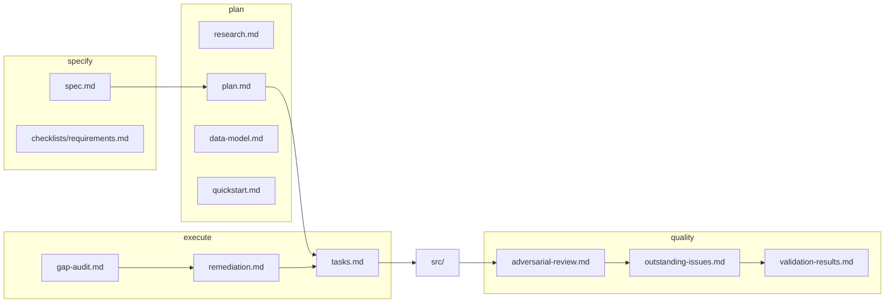

# Lessons Learned: Spec Kit on rust-feh (Feature 001)

**Feature**: `001-persistent-ui-virtual-browsing`  
**Created**: 2026-06-21  
**Audience**: Anyone running Spec Kit (specify → plan → tasks → implement → review) on a real codebase — especially brownfield GUI work where the spec, code, and user feedback diverge.

This document **decomposes everything that happened** on rust-feh: the intended Spec Kit pipeline, what actually shipped, where artifacts lied, how gaps were closed, and what **post-spec UX work** taught us. Use it as a case study, not as a replacement for [spec.md](./spec.md).

---

## 1. Executive summary (30 seconds)

| Question | Answer |
|----------|--------|
| What did we specify? | Persistent top/bottom panels, virtualized 10k image list, filter, explicit feh launch, status bar, scanning indicator |
| Did Spec Kit work? | **Yes, with caveats** — it forced traceability (FR-001–FR-015), caught doc/code drift, and produced automatable validation |
| Biggest win | Turning “feels done” into **two-tier truth**: `code pass` vs `validated pass` |
| Biggest gap | **Original spec did not cover** window sizing, folder columns, sort, feh tiny-image behavior — users found these in live use |
| Safe lesson | **Specify the failure modes users fear** (window vanishing, layout jump, empty space) not only the happy path |

---

## 2. How Spec Kit phases mapped to this project

Spec Kit is a **document pipeline**. Each phase produces an artifact the next phase consumes. On rust-feh the chain looked like this:



### 2.1 `/speckit-specify` — WHAT and WHY

**Input (implicit)**: “Refactor egui layout: controls always visible, virtual list for large folders, don’t auto-open feh.”

**Output**: [spec.md](./spec.md) with:

- **User stories** (US1 controls, US2 virtual browse, US3 explicit feh)
- **Functional requirements** FR-001–FR-015 (testable statements)
- **Success criteria** SC-001–SC-007 (some measurable, some subjective)
- **Clarifications** sessions (grew over time — see §4)

**Lesson — specify like a tester, not a builder**

| Good specify habit | rust-feh example |
|--------------------|------------------|
| Testable FRs | FR-005 “filter resets scroll” → later implemented as `scroll_generation` + `id_salt` |
| Measurable SCs | SC-003 “filter <200ms on 10k” → became `sc003_filter_10k_under_200ms` test |
| Bounded scope | “No auto-feh on load” (FR-007) — clear, grep-able |
| Missing specify habit | No FR for “list shows folder path”, “user can sort”, “window size is stable” — **shadow work** later |

**Anti-pattern we hit**: Spec said “filter on filenames” (FR-005/FR-006) but users naturally expected **folder path in list + folder-aware filter**. That’s a specify gap, not an implement bug.

---

### 2.2 `/speckit-plan` + `/speckit-tasks` — HOW (at design level)

**Outputs**: [plan.md](./plan.md), [research.md](./research.md), [data-model.md](./data-model.md), [quickstart.md](./quickstart.md), [tasks.md](./tasks.md) (69 tasks, Phases 1–7).

**Lesson — brownfield plans must say “partially done”**

The plan honestly noted core layout already existed. That prevented a rewrite fantasy and shifted work to **gap audit + validation** — the right move for Spec Kit on existing code.

**Lesson — tasks are a contract with the future**

Tasks linked every change to a file path and FR id (`T010` → `feh_available` in `main.rs`). When an agent (or human) gets lost, `tasks.md` is the map back to intent.

---

### 2.3 `/speckit-clarify` — resolve ambiguity without meetings

We ran clarify **three times** (documented in spec.md Clarifications):

1. After gap audit — scroll reset mechanism, feh button behavior, permission warnings
2. After pre-implement adversarial review — artifact authority, startup log policy
3. After post-implement review — bucket classification (A/B/C/D)

**Lesson — automated clarify works when options are enumerable**

Most questions were resolved from code + constitution without asking the user. That’s fast, but risks **rubber-stamping** wrong assumptions. The adversarial review pass corrected that.

**Lesson — clarify should update spec, not only chat**

Every answer was written back into `spec.md` Clarifications. Downstream agents read one file instead of conversation archaeology.

---

### 2.4 Gap audit + remediation — decompose before implement

| Artifact | Role |
|----------|------|
| [gap-audit.md](./gap-audit.md) | FR × Status matrix (`pass` / `gap` / `partial`) |
| [remediation.md](./remediation.md) | Phases A–H: exact file edits, verify commands, task IDs |

**Lesson — gap-audit is the bridge between spec and tasks**

Without T004’s gap table, implementers cherry-pick “obvious” fixes. With it, **nothing is done until a row moves to pass with evidence**.

**Lesson — remediation is “implement for humans and agents”**

Phases like A1 (`feh_available`), A3 (`scroll_generation`), H1 (`lib` + `ui_logic` split) gave copy-pasteable steps. This is what `/speckit-implement` consumed.

---

### 2.5 `/speckit-implement` — code landing

**What landed in code** (high level):

- `TopBottomPanel` + `CentralPanel` layout
- `ScrollArea::show_rows` virtualization
- `feh_available`, `scanning`, `scroll_generation`, `prior_search`
- `scanner.rs` permission-denied warnings
- `src/lib.rs` + `src/ui_logic.rs` for testable logic
- `tests/feature_001_validation.rs` + `scripts/validate-feature-001.sh`
- FR-008a fix: `post_scan_status()` appends feh warning when absent

**Lesson — constitution gates saved us**

Constitution §III (“GUI state in `main.rs`, logic in core modules”) forced `ui_logic.rs` instead of stuffing filter/status into egui callbacks. That made SC-003 automatable.

---

### 2.6 Adversarial review — assume the docs are wrong

[adversarial-review.md](./adversarial-review.md) (pre- and post-implement) found:

| Severity | Finding |
|----------|---------|
| HIGH | gap-audit claimed 15/15 pass without perf validation |
| HIGH | `list_scroll_offset` in data-model vs `scroll_generation` in code |
| MEDIUM | FR-008a feh message dropped after folder load |
| LOW | Dead types, duplicate menu checkbox |

**Lesson — review file-by-file AND artifact-by-artifact**

Code review alone would miss “T012 checked but field name wrong in data-model”. Spec Kit’s value is **traceability review**: spec ↔ plan ↔ tasks ↔ code ↔ quickstart.

---

### 2.7 `/speckit-converge` — stop duplicate chasing

[outstanding-issues.md](./outstanding-issues.md) introduced **four buckets**:

| Bucket | Meaning | Action |
|--------|---------|--------|
| **A** | Not a bug — doc drift or equivalent implementation | Sync artifacts only |
| **B** | Real code gap | Implement (T065, T069) |
| **C** | Manual validation | One session T067, not eight tasks |
| **D** | Deferred | Area 6+ backlog |

**Lesson — bucket A is where teams waste the most time**

`feh_button` vs `ui.add_enabled` and `scroll_generation` vs `list_scroll_offset` looked like failures. They were **equivalent implementations**. Converge explicitly labeled them A1/A2 so implement didn’t “fix” working code.

---

### 2.8 Validation — automate what hurts; admit what you can’t

| Tier | Meaning | rust-feh |
|------|---------|----------|
| **code** | Static grep, structure, unit tests | 13 checks in `validate-feature-001.sh` |
| **validated** | Human GUI session | SC-002 60fps scroll, SC-004 RSS <150MB still manual |

User pushback: “I don’t want manual quickstart V1–V10.” Response: automate substitutes (10k scan, filter perf, permission test, FR static checks) and **label** what remains manual.

**Lesson — honesty in validation-results.md builds trust**

[validation-results.md](./validation-results.md) says plainly: RSS and scroll feel are manual. That’s better than a green checkbox lie.

---

## 3. Timeline: what happened in what order

Use this when onboarding someone to the repo artifacts.

1. **Specify** feature 001 — persistent UI + virtual browsing  
2. **Plan / tasks** — 64+ tasks against FR-001–FR-015  
3. **Pre-implement adversarial review** — spec vs aspirational “done”  
4. **Clarify + gap-audit + remediation** — decomposed fix list  
5. **Implement Phases A–H** — core feature in `src/`  
6. **Post-implement adversarial review** — 10 open tasks, artifact drift  
7. **Converge** — buckets A–D, Phase 7 tasks T065–T069  
8. **Automate validation** — script + integration tests (T067/T068 partial)  
9. **Live UX feedback (outside original spec)** — see §5  
10. **This document** — meta-learning for the next specify pass  

---

## 4. Decomposition by concern (the “what happened” matrix)

| Concern | Spec Kit coverage | What we did | Lesson for next specify |
|---------|-------------------|-------------|-------------------------|
| Controls always visible | FR-001, US1 | `TopBottomPanel::top` | ✅ Specify layout regions by name |
| Virtual list 10k | FR-004, US2 | `show_rows` | ✅ Specify algorithm family, not widget API |
| Filter speed | SC-003, FR-005 | `filter_indices` + perf test | ✅ Put ms budget in SC, test in lib |
| No auto-feh | FR-007, US3 | Removed spawn on load | ✅ Specify negative requirements (“MUST NOT”) |
| feh missing UX | FR-008a | `feh_button`, `post_scan_status` | ✅ Specify persistent vs primary status line |
| Permission denied | FR-015 | scanner warnings | ✅ Specify error visibility (user vs debug log) |
| Scroll reset on filter | FR-005 | `scroll_generation` | ✅ Specify behavior; let implement pick idiom |
| Window resize / empty space | ❌ not in spec | `auto_shrink`, min size, stable toolbar | ⚠️ Add UX stability FRs next time |
| Folder column + sort | ❌ not in spec | `relative_folder`, `SortMode`, `list_indices` | ⚠️ Specify list columns in US2 |
| feh 5px image window | ❌ not in spec | `--geometry`, `--zoom max`, clamp floor | ⚠️ Specify external tool failure modes |
| Window size setting | ❌ not in spec | View → presets + resizable toggle | ⚠️ Specify window policy as user story |

---

## 5. Shadow work — features users asked for after “done”

After Spec Kit declared the core feature implemented, **conversation-driven UX** added:

1. **Stable window** — no layout jump when folder loads; list fills panel  
2. **Window size settings** — presets + resizable toggle (View menu)  
3. **Folder + filename columns** — relative path from scan root  
4. **Sort** — Path / Name / Folder  
5. **feh tiny images** — fixed geometry + upscale so window doesn’t “vanish”  

None of these were in the original `/speckit-specify` input. They are **obvious in hindsight** for a file browser.

### Lesson — run a “specify supplement” after first dogfood

Recommended workflow addition:

```
/speckit-specify  →  implement MVP  →  dogfood  →  /speckit-specify (delta)  →  converge
```

Treat shadow work as **Feature 001b** or a new `002-list-and-window-ux` spec instead of orphan commits.

---

## 6. What Spec Kit did well (keep doing this)

1. **FR IDs** — arguing about “persistent feh message” became FR-008a with a one-line fix spec  
2. **Quickstart V1–V10** — even when manual, scenarios are reusable acceptance tests  
3. **Remediation phases** — agents didn’t guess; they followed A1→H1  
4. **Lib split for testability** — plan + constitution → measurable SC-003  
5. **Adversarial review** — caught overclaim in gap-audit before release  
6. **Supersession table in tasks.md** — T067 replaced eight duplicate validation tasks without losing audit trail  

---

## 7. What hurt (avoid next time)

| Pain | Root cause | Fix in next specify |
|------|------------|---------------------|
| “15/15 FR pass” but not shippable | Single-tier audit | Always split **code** vs **validated** columns |
| data-model drift | Implemented before model updated | Task: “update data-model” in same PR as code |
| Manual V1–V10 fatigue | GUI-only criteria | Write SCs with an **automation tier** upfront |
| Shadow UX work | Spec stopped at virtualization | Add US for “list presentation” and “window policy” |
| feh window shock | External subprocess not in spec | Add integration requirements for delegated tools |
| Skills path confusion | Hermes vs Grok skill dirs | Document in README where agents discover `/speckit-*` |

---

## 8. If you were writing the spec again (template for learners)

Use this checklist the **first time** you `/speckit-specify` a GUI tool:

### User scenarios (mandatory)

- [ ] Empty state (no folder loaded) — what is visible/disabled?  
- [ ] Large collection (10k) — scroll, filter, memory  
- [ ] External tool launch (feh) — success, missing binary, tiny/huge images  
- [ ] Window behavior — resize, minimum size, layout stability when content loads  
- [ ] List columns — what does each row show? sort? filter scope?  

### Functional requirements (patterns that worked)

```
FR-0xx: The application MUST [behavior] when [condition].
```

Add **MUST NOT** for regressions (e.g. MUST NOT auto-spawn feh on scan complete).

### Success criteria (two-tier)

```
SC-00x (automated): [metric] verified by `cargo test` / script  
SC-00y (manual): [subjective] verified by quickstart Vn with notes  
```

Never mark SC manual as pass in gap-audit without a dated note in validation-results.md.

### Clarifications (cap at 3 interactive)

Reserve interactive clarify for **scope forks**. Everything else → adversarial review + converge buckets.

---

## 9. Artifact reading guide (for new contributors)

| Read first | When you need |
|------------|---------------|
| [spec.md](./spec.md) | Intent, FRs, clarifications |
| [quickstart.md](./quickstart.md) | Hands-on acceptance steps |
| [gap-audit.md](./gap-audit.md) | Current FR status |
| [tasks.md](./tasks.md) | What was supposed to be done |
| [remediation.md](./remediation.md) | How fixes were decomposed |
| [adversarial-review.md](./adversarial-review.md) | What reviewers distrusted |
| [outstanding-issues.md](./outstanding-issues.md) | What’s still open vs noise |
| [validation-results.md](./validation-results.md) | Last automated run |
| **this file** | Meta-lessons across the whole arc |

---

## 10. Suggested follow-up specs (to formalize shadow work)

If continuing Spec Kit on rust-feh, create **new specify passes** (don’t silently extend 001):

| Short name | User-facing title | Core requirements to write |
|------------|-------------------|----------------------------|
| `list-columns-sort` | Folder-aware list | Column layout, sort modes, filter matches path |
| `window-policy` | Window size settings | Presets, resizable lock, minimum floor, persistence |
| `feh-launch-contract` | feh viewer behavior | Fixed geometry, zoom policy for tiny images, documented flags |

Each should get its own `spec.md` → plan → tasks → implement cycle. Feature 001 stays the **foundation**; 002+ are **presentation and polish**.

---

## 11. One-paragraph version for standups

We used Spec Kit to refactor rust-feh’s egui shell for large folders: specify gave us FR-001–FR-015; plan/tasks broke work into 69 traceable items; gap-audit and remediation decomposed fixes; implement landed virtualization and testable `ui_logic`; adversarial review caught doc overclaim and artifact drift; converge sorted real bugs from noise; automation replaced most manual quickstart checks. Users then found UX gaps (window stability, folder columns, sort, feh tiny images) that **were never specified** — the lesson is to specify layout/window/list presentation and external-tool failure modes up front, and to always separate **code pass** from **validated pass**.

---

*Generated as a learning artifact for feature 001. Not a normative spec — for requirements, see [spec.md](./spec.md).*